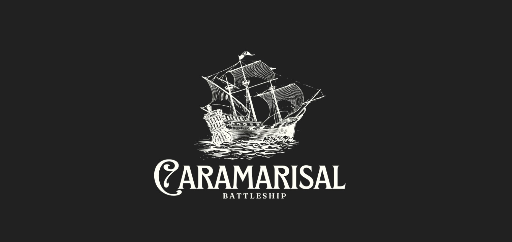

# 
**Bienvenidos a la flota de Caramarisal☠️**

Este proyecto surge a raíz de una actividad en la que se nos planteó la idea de desarrollar un videojuego basado en el clásico juego de barcos de Hundir La Flota. 
En el siguiente documento se muestran los detalles del juego. Las reglas implementadas, recursos y librerías utilizadas, así como otras particularidades del mismo. 
Para cualquier duda, aquí el enlace a nuestro perfil de gitHub.

*Marina G. de Juan [@marinagoju](https://github.com/marinagoju)*   
*Aída [@yporquenoahora](https://github.com/yporquenoahora)*  

1. [Reglas del Juego](#id1)
2. [Funciones añadidas](#id2)
3. [Recursos](#id3) 
4. [Librería de Python](#id4)  

## 📜 **1. Reglas del Juego**

El juego consta de dos jugadores. Un primer jugador que definimos como **la maquina**, y un segundo jugador que sería el mismo **usuario** que ejecuta el programa.

El objetivo del juego consiste en hundir todos los barcos de la flota enemiga, sin que esta hunda antes los nuestros.

Cada **flota de barcos** se compone de:

* 1 barco de 4 de eslora (4 casillas).
* 2 barcos de 3 de eslora (3 casillas).
* 3 barcos de 2 de eslora (2 casillas).
* 4 barcos de 1 de eslora (1 casilla).

Además el jugador tiene dos tableros de dimensión 10x10:

* **Tablero de barcos**. Muestra la ubicación de los barcos del propio jugador y las coordenadas de los disparos realizados por "la maquina".
* **Tablero de impactos**. Muestra la ubicación de los disparos realizados por el jugador.

Al principio de la partida los barcos se colocan de manera aleatoria en el tablero de barcos. Cada turno se le solicitarán unas coordenadas al usuario para disparar a la flota enemiga: una letra de la **A a la J** para el eje de abcisas, y un número del **1 al 10** para el eje de ordenadas. Los tableros Se van actualizando en función de los disparos realizados:

* Si el disparo impacta en un barco enemigo, aparecerá **"X"** en la coordenada concreta del tablero de impactos del jugador y podrá volver a disparar de nuevo.
* Si el disparo impacta en el agua, aparecerá **"-"** en la coordenada concreta del tablero de impactos del jugador y perderá el turno.

Cuando es el turno de "la maquina" se generan unas coordenadas aleatorias de disparo:

* Si "la maquina" impacta en un barco aliado, aparecerá **"X"** en la coordenada concreta del tablero de barcos del jugador, y disparará de nuevo.
* Si "la maquina" impacta en el agua, aparecerá **"-"** en la coordenada concreta del tablero de barcos del jugador, y perderá el turno.

Gana el jugador que antes consiga hundir los barcos del otro jugador.
 
  
### 🕹️ **2. Otras Funcionalidades**  

Hemos considerado que los barcos puedan estar ubicados juntos, es decir que pueda no haber espacios entre barcos. Aunque también se puede activar la función para que no puedan estar ubicados juntos. Esa parte del código está comentada para que no se ejecute, así que basta con descomentarla (línea 70 de utils.py).

En un principio el juego está implementado de manera que hubiera un único jugador que jugara contra "la maquina", y que esta fuera respondiendo a los inputs que el jugador introduce por la terminal. Es por esto que los tableros del jugador "maquina" no se muestran. Pero podría modificarse para dos jugadores "humanos".

Añadimos una **función de salir** en caso de que el jugador quiera salir del juego. Simplemente introduciendo 'salir' por consola.

Las dimensiones del tablero están definidas por la constante **lenTablero** que podría ser modificada para ampliarlo o disminuirlo. 
### ⚙️ **3. Recursos**
* https://parzibyte.me/blog/2021/12/21/batalla-naval-python-programacion-juego/
* https://pandao.github.io/editor.md/en.html
* https://www.delftstack.com/es/howto/python/python-exit-program/
* http://es.battleship-game.org/
* https://note.nkmk.me/en/python-chr-ord-unicode-code-point/
* https://www.canva.com/ (@sonisokell)
* Otros recursos de Data Science The bridge.  
## 📚**4. Librerías de Python**
* Numpy  
